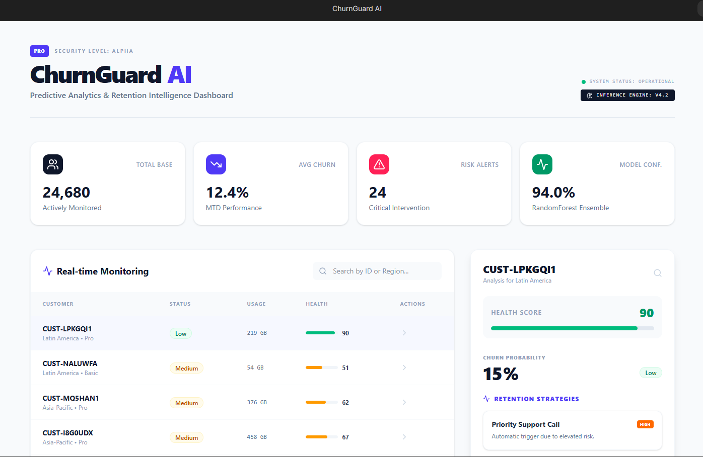

# ChurnGuard AI 🚀

**ChurnGuard AI** is a professional predictive analytics dashboard designed to monitor customer health and forecast churn risks in real-time. By leveraging machine learning ensembles, it provides actionable insights and automated retention strategies to minimize customer attrition.



## ✨ Features
*   **Real-time Monitoring:** Track customer health scores and usage patterns across global regions.
*   **Predictive Intelligence:** High-confidence churn probability forecasting using RandomForest Ensembles.
*   **Retention Strategies:** Automated, risk-based intervention triggers (e.g., Priority Support Calls).
*   **Feature Importance:** Visual breakdown of key churn drivers like Support Tickets and NPS Scores.

## 🛠️ Tech Stack
*   **Frontend:** React, TypeScript, Vite, Tailwind CSS
*   **Analytics:** Machine Learning Services (RandomForest)
*   **API:** Gemini Service Integration for intelligent insights
*   **Icons/UI:** Lucide React, Custom Aesthetic Components

## 🚀 Getting Started

### Prerequisites
* Node.js (v18+)
* npm or yarn

### Installation
1. Clone the repository:
   
```bash
   git clone [https://github.com/Vani691/churn-guard-ai.git](https://github.com/Vani691/churn-guard-ai.git)
```
2. Install dependencies:

```bash
   npm install
```

3. Create a .env file based on .env.example and add your API keys.

4. Start the development server:

```bash
   npm run dev
```   

### 📊 Data Insights

- The system analyzes several key metrics to determine risk:

- Support Tickets: The highest weight driver for churn.

- NPS Score: Critical indicator of customer sentiment.

- Engagement Rate: Tracking active vs. passive usage.


### Developed with ❤️ by Shravani Mane   